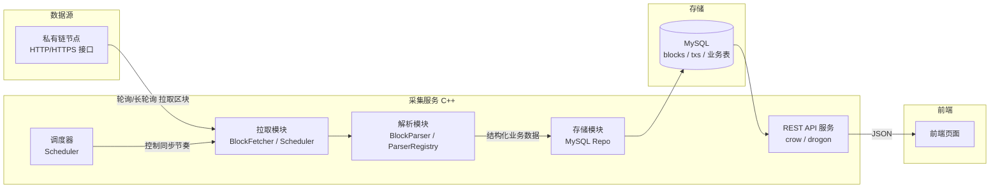
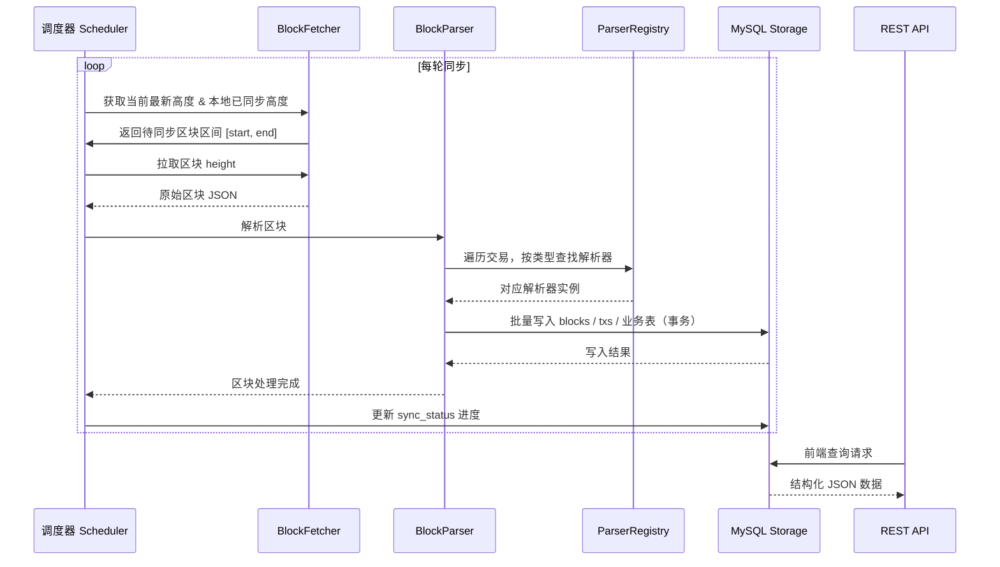
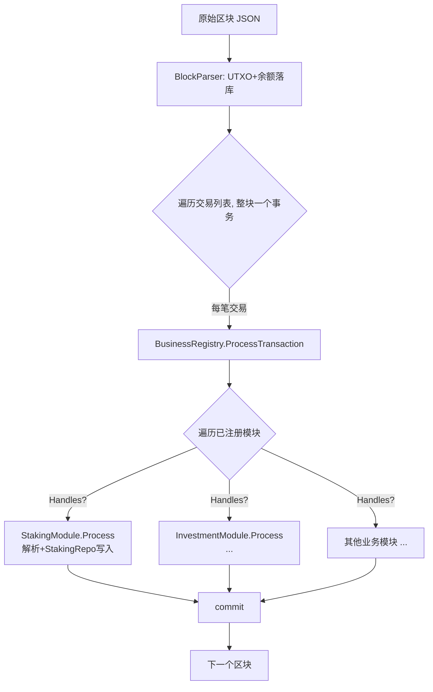

# 区块链数据解析与展示系统 — 架构设计方案

> 版本：v1.0
> 日期：2026-08-21
> 语言：C++20
> 数据库：MySQL 8.0+

---

## 1. 项目概述

### 1.1 项目目标

本项目是一个 **区块链数据采集与解析服务**，负责：

1. 通过 **HTTP/HTTPS** 从自定义/私有链节点拉取原始数据块（Block）。
2. 解析区块内容：一个区块内包含多条不同类型的交易（质押、解质押、投资等）。
3. 将解析后的业务数据（结构化）落库到 **MySQL**。
4. 通过 **REST API** 将数据提供给前端页面进行展示与查询。

### 1.2 核心需求

| 需求 | 说明 |
| --- | --- |
| 数据拉取 | 通过 HTTP/HTTPS 接口从链节点增量拉取区块 |
| 数据解析 | 一个区块含多条交易，需按交易类型分发解析（质押/解质押/投资…） |
| 数据存储 | 解析结果写入 MySQL，支持断点续拉、幂等去重 |
| 数据展示 | 提供 REST API 供前端查询区块、交易、业务数据与统计信息 |
| 可扩展性 | 新增业务类型（如"借贷""转账"）时，只增加解析器即可，不改动主流程 |

### 1.3 设计原则

- **模块化**：拉取 / 解析 / 存储 / API 四层解耦，各自独立可替换。
- **可扩展**：交易解析采用"解析器注册表（Parser Registry）"模式，业务类型可插拔。
- **可靠**：断点续拉、幂等写入、失败重试、异常告警。
- **高性能**：批量入库、连接池、异步 HTTP、可选并行解析。
- **可观测**：统一日志（spdlog）+ 状态表 + 健康检查接口。

---

## 2. 总体架构



### 2.1 分层职责

| 层 | 模块 | 职责 |
| --- | --- | --- |
| 采集层 | 拉取模块 | 与链节点通信，拉取区块原始数据，维护同步进度 |
| 解析层 | 解析模块 | 将原始区块按交易类型拆分、解析为业务模型 |
| 存储层 | 存储模块 | 批量写入 MySQL，提供查询接口（供 API 层使用） |
| 服务层 | REST API | 向前端提供 JSON 查询接口 |
| 公共层 | common | 配置、日志、线程池、工具类 |

### 2.2 核心数据流



---

## 3. 技术选型

| 组件 | 推荐方案 | 备选方案 | 说明 |
| --- | --- | --- | --- |
| 语言标准 | C++20 | C++17 | 使用 `std::jthread`、concepts 等 |
| 构建工具 | CMake ≥ 3.20 | — | 统一构建与依赖管理 |
| HTTP 客户端 | libcurl | cpr | 拉取区块数据 |
| HTTP 服务端 | crow | drogon / cpp-httplib | REST API 服务 |
| JSON 库 | nlohmann/json | rapidjson | 区块解析与 API 序列化 |
| MySQL 驱动 | mysql-connector-c++ | mysqlclient / sqlpp11 | 数据库访问 |
| 连接池 | 自研（基于 mysql-connector） | — | 管理 MySQL 连接复用 |
| 日志 | spdlog | — | 分级日志 + 滚动文件 |
| 线程/并发 | std::thread + 自研线程池 | TBB | 并行解析 |
| 单元测试 | GoogleTest | Catch2 | 测试解析器与工具 |
| 数据库部署 | 便携式脚本部署（绿色版 MySQL 二进制） | Docker | 无需容器环境，一键初始化/启停，便于迁移 |
| 配置管理 | JSON 配置文件 | YAML | 启动时加载 |

---

## 4. 目录结构

```
hubsql/
├── CMakeLists.txt                 # 顶层构建脚本
├── README.md
├── config/
│   └── config.json                # 服务配置（链地址、MySQL、同步参数）
├── docs/
│   └── 架构设计方案.md
├── sql/
│   ├── schema.sql                 # 建表语句
│   └── migration/
│       └── v001_init.sql          # 增量迁移脚本
├── src/
│   ├── main.cpp                   # 程序入口，组装各模块
│   ├── common/                    # 公共基础
│   │   ├── logger.h / .cpp        # spdlog 封装
│   │   ├── config.h / .cpp        # 配置加载
│   │   ├── thread_pool.h / .cpp   # 线程池
│   │   └── json_utils.h           # JSON 工具
│   ├── fetcher/                   # 采集层
│   │   ├── http_client.h / .cpp   # libcurl 封装
│   │   ├── block_fetcher.h / .cpp # 拉取单个/批量区块
│   │   └── sync_scheduler.h/.cpp  # 同步调度、进度管理
│   ├── parser/                    # 解析层
│   │   ├── block_parser.h / .cpp  # 区块 -> 交易分发（组装各业务解析+仓库）
│   │   └── parsers/               # 每业务一个解析器（按业务拆分）
│   │       ├── staking_parser.h / .cpp
│   │       ├── unstaking_parser.h / .cpp
│   │       ├── invest_parser.h / .cpp
│   │       └── ...
│   ├── model/                     # 数据模型
│   │   ├── block.h                # 区块模型
│   │   ├── transaction.h          # 交易模型
│   │   └── business/              # 业务记录结构（每业务一个，按业务拆分）
│   │       ├── stake_record.h / .cpp
│   │       ├── unstake_record.h / .cpp
│   │       └── investment_record.h / .cpp
│   ├── storage/                   # 存储层
│   │   ├── db_pool.h / .cpp       # MySQL 连接池
│   │   ├── block_repo.h / .cpp    # 区块表读写
│   │   ├── tx_repo.h / .cpp       # 交易表读写
│   │   ├── staking_repo.h/.cpp    # 质押存储（插入+解质押标记+查询）
│   │   ├── investment_repo.h/.cpp # 投资存储（扩展用）
│   │   └── sync_repo.h / .cpp     # 同步状态读写
│   └── api/                       # 服务层
│       ├── api_server.h / .cpp    # REST 服务启动
│       ├── controllers/           # 控制器（每业务一个，按业务拆分）
│       │   ├── block_controller.cpp
│       │   ├── tx_controller.cpp
│       │   ├── staking_controller.cpp
│       │   ├── investment_controller.cpp
│       │   └── balance_controller.cpp
│       └── middleware/            # 日志、鉴权、限流
├── tests/
│   ├── unit/                      # 单元测试（解析器、工具）
│   └── integration/               # 集成测试（端到端同步）
├── deploy/                        # 便携式部署脚本
│   ├── mysql-portable/            # 便携式 MySQL（绿色版二进制 + 数据）
│   │   ├── config/my.cnf
│   │   └── scripts/
│   │       ├── install.sh         # 下载解压 + 初始化数据目录
│   │       ├── start.sh / stop.sh / status.sh
│   │       └── init_db.sh         # 建库建用户 + 导入 schema
│   └── start_collector.sh         # 采集服务启动脚本（systemd/nohup）
└── third_party/
```

---

## 5. 核心设计

### 5.1 拉取模块（采集层）

**职责**：与链节点 HTTP 接口通信，增量拉取区块原始数据。

**关键点**：

- **HTTP 客户端封装**：基于 libcurl，支持超时、重试、连接复用。
- **同步调度器**：
  - 每轮先查询"最新高度"（如 `GET /api/v1/chain/height`）。
  - 对比本地 `sync_status` 表记录的最后同步高度。
  - 按批次（如每次 10~100 个区块）拉取，避免单次请求过大。
- **同步策略**：
  - **全量同步**：首次启动从起始高度拉取到当前高度。
  - **增量同步**：后续每隔固定间隔（如 3s）轮询新区块。
  - 支持 **断点续拉**：重启后从上次记录的高度继续，无需重扫。
- **失败重试**：指数退避（1s→2s→4s…封顶 60s），超过阈值告警。

```cpp
// 伪代码：同步调度主循环
class SyncScheduler {
public:
    void Run() {
        while (running_) {
            auto latest   = fetcher_.GetLatestHeight();      // 最新高度
            auto local    = sync_repo_.GetLastSyncedHeight(); // 本地进度
            for (uint64_t h = local + 1; h <= latest; ++h) {
                auto block = fetcher_.FetchBlock(h);          // 拉取原始区块
                parser_.ParseAndStore(block);                 // 解析 + 入库
                sync_repo_.UpdateProgress(h);                 // 更新进度
            }
            Sleep(sync_interval_);
        }
    }
};
```

### 5.2 解析模块（核心扩展点）

**职责**：把原始区块拆分为多条交易，再按交易类型分发到对应解析器。

#### 5.2.1 业务模块接口（解析 + 存储 一体，注册制）

每个业务 = **一个模块**，封装"记录结构 + 解析逻辑 + 存储逻辑"，注册进 `BusinessRegistry`。
主流水线与 REST API 均按注册的模块统一分发，新增业务无需改动框架代码。

```cpp
// parser/ibusiness_module.h
class IBusinessModule {
public:
    virtual ~IBusinessModule() = default;
    virtual std::string Name() const = 0;              // 业务名：staking/investment...
    virtual bool Handles(const Transaction& tx) const = 0;      // 是否处理该交易类型
    virtual int Process(sql::Connection& conn, const Transaction& tx,
                        uint64_t block_height) = 0;             // 解析并落库（事务内）
    virtual nlohmann::json List(const nlohmann::json& filter,
                                int page, int size) = 0;        // REST 列表
    virtual nlohmann::json Counts() = 0;                        // REST 统计
};
```

#### 5.2.2 业务注册表（BusinessRegistry）

```cpp
// parser/business_registry.h
class BusinessRegistry {
public:
    void Register(std::shared_ptr<IBusinessModule> module);
    int ProcessTransaction(sql::Connection& conn, const Transaction& tx,
                           uint64_t height);          // 分发给 Handles(tx) 的模块
    IBusinessModule* Find(const std::string& name) const;
    std::vector<IBusinessModule*> All() const;
};
```

#### 5.2.3 区块解析流程



#### 5.2.4 REST API 通用分发

`/api/v1/business/{name}?address=&is_unstaked=&page=&size=` 按业务名查找模块并调用 `List`；
另有别名 `/api/v1/staking`、`/api/v1/unstaking`（`is_unstaked=1` 视图）、`/api/v1/investments`；
`/api/v1/stats/overview` 聚合所有已注册模块的 `Counts()`。

#### 5.2.5 新增业务类型的扩展步骤

**注册制**：只需 4 步，不改主流水线与控制器：

1. 定义记录结构：`model/business/xxx_record.h`
2. 定义解析逻辑：`parser/parsers/xxx_parser.*`
3. 定义存储：`storage/xxx_repo.*`
4. 封装为模块：`parser/parsers/xxx_module.*`（实现 `IBusinessModule`），在 `main.cpp` 中 `registry.Register(...)`

例如新增"借贷（lend）"：

```cpp
// parser/parsers/lend_module.h —— 模块 = 解析 + 存储
class LendModule final : public IBusinessModule {
public:
    LendModule(LendRepo& repo) : repo_(repo) {}
    std::string Name() const override { return "lend"; }
    bool Handles(const Transaction& tx) const override { return tx.type == 20; }
    int Process(sql::Connection& conn, const Transaction& tx, uint64_t h) override {
        for (auto& r : lend_parser_.Parse(tx)) { r.block_height = h; repo_.Insert(conn, r); }
        return 1;
    }
    nlohmann::json List(const nlohmann::json& f, int p, int s) override { /* 查 lend 表 */ }
    nlohmann::json Counts() override { return {{"lending_records", repo_.Count()}}; }
private:
    LendRepo& repo_;
    LendParser lend_parser_;
};
```

`main.cpp` 中注册一次即可（`registry.Register(std::make_shared<LendModule>(lend_repo));`），
流水线与 `/api/v1/business/lend` 自动生效。

### 5.3 存储模块（MySQL）

#### 5.3.1 连接池

- 基于 mysql-connector-c++ 封装连接池，配置最大/最小连接数。
- 提供 `WithConnection(...)` 回调式 API，自动取还连接。
- 业务写入走**连接级**接口（`repo.Insert(conn, rec)`），由 BlockParser 按区块统一开事务提交。

#### 5.3.2 表设计概览

| 表 | 用途 | 核心字段 |
| --- | --- | --- |
| `blocks` | 区块主表 | `height`(PK)、`hash`、`timestamp`、`tx_count`、`parse_status` |
| `transactions` | 全部交易明细 | `tx_hash`(PK)、`block_height`、`type`、`from`、`to`、`raw_json` |
| `staking_records` | 质押业务 | `id`、`tx_hash`、`address`、`amount`、`block_height`、`created_at` |
| `unstaking_records` | 解质押业务 | 同上结构 |
| `investment_records` | 投资业务 | 同上结构 + 业务专属字段 |
| `sync_status` | 同步进度 | `id`、`last_synced_height`、`status`、`updated_at` |

> 说明：业务表与交易表通过 `tx_hash` 关联；`transactions.raw_json` 保留原始数据便于追溯与补解析。

#### 5.3.3 幂等与一致性

- **幂等写入**：`blocks.height`、`transactions.tx_hash` 均设为主键/唯一键，重复入库自动忽略（`INSERT IGNORE` / `ON DUPLICATE KEY UPDATE`）。
- **事务控制**：单个区块的所有写入（blocks + txs + 业务表）在同一事务内完成，保证原子性。
- **失败回滚**：某区块解析/入库失败，事务回滚，`sync_status` 不前进，下一轮重试该区块。

#### 5.3.4 建表示例（schema.sql 片段）

```sql
CREATE TABLE IF NOT EXISTS blocks (
    height       BIGINT UNSIGNED PRIMARY KEY,
    hash         VARCHAR(128) NOT NULL,
    timestamp    BIGINT UNSIGNED NOT NULL,
    tx_count     INT UNSIGNED NOT NULL DEFAULT 0,
    parse_status TINYINT NOT NULL DEFAULT 0 COMMENT '0=待处理 1=成功 2=失败',
    created_at   TIMESTAMP DEFAULT CURRENT_TIMESTAMP,
    UNIQUE KEY uk_hash (hash)
) ENGINE=InnoDB;

CREATE TABLE IF NOT EXISTS transactions (
    tx_hash      VARCHAR(128) PRIMARY KEY,
    block_height BIGINT UNSIGNED NOT NULL,
    type         VARCHAR(32) NOT NULL COMMENT 'staking/unstaking/invest/...',
    from_addr    VARCHAR(128) NOT NULL,
    to_addr      VARCHAR(128),
    amount       DECIMAL(36, 18) DEFAULT 0,
    raw_json     JSON,
    created_at   TIMESTAMP DEFAULT CURRENT_TIMESTAMP,
    KEY idx_block_height (block_height),
    KEY idx_type (type),
    KEY idx_from_addr (from_addr)
) ENGINE=InnoDB;

CREATE TABLE IF NOT EXISTS sync_status (
    id                 INT PRIMARY KEY AUTO_INCREMENT,
    last_synced_height BIGINT UNSIGNED NOT NULL DEFAULT 0,
    status             VARCHAR(16) NOT NULL DEFAULT 'running',
    updated_at         TIMESTAMP DEFAULT CURRENT_TIMESTAMP ON UPDATE CURRENT_TIMESTAMP
) ENGINE=InnoDB;
```

### 5.4 REST API 服务层

**技术**：crow（轻量）或 drogon（重量级、自带 ORM）。以下以 crow 为例。

#### 5.4.1 API 设计

| 方法 | 路径 | 说明 |
| --- | --- | --- |
| GET | `/health` | 健康检查 |
| GET | `/api/v1/blocks?start=&end=&page=&size=` | 区块列表（分页） |
| GET | `/api/v1/blocks/{height}` | 区块详情 |
| GET | `/api/v1/txs?type=&address=&page=&size=` | 交易列表（可按类型/地址过滤） |
| GET | `/api/v1/txs/{tx_hash}` | 交易详情 |
| GET | `/api/v1/staking?address=&page=&size=` | 质押记录 |
| GET | `/api/v1/unstaking?address=&page=&size=` | 解质押记录 |
| GET | `/api/v1/investments?address=&page=&size=` | 投资记录 |
| GET | `/api/v1/stats/overview` | 全局统计（总量、最新高度等） |
| GET | `/api/v1/stats/{address}` | 指定地址的资产统计 |

统一返回结构：

```json
{
  "code": 0,
  "message": "ok",
  "data": {
    "list": [ ... ],
    "total": 1000,
    "page": 1,
    "size": 20
  }
}
```

#### 5.4.2 API 与采集的并发关系

- 采集进程与 API 服务可以同进程（两个线程组），也可**拆分为两个独立服务/进程**，共享同一个 MySQL。
- 推荐**拆分**：采集服务（高 IO）与 API 服务（高并发读）独立部署、独立扩缩容，避免相互影响。

---

## 6. 并发与性能设计


| 环节 | 策略 |
| --- | --- |
| 区块拉取 | 按高度串行，保证顺序与幂等 |
| 区块解析 | 线程池并行解析多个区块（解析无状态，天然可并行） |
| 数据库写入 | 批量预处理语句，按批次提交 |
| API 读取 | 连接池 + 只读副本（可选读写分离） |
| 大表 | `transactions` 按类型分表或按时间分区（可选） |

---

## 7. 配置设计（config.json）

```json
{
  "chain": {
    "base_url": "http://127.0.0.1:8545",
    "start_height": 0,
    "sync_interval_seconds": 3,
    "batch_size": 50,
    "http": { "timeout_ms": 10000, "retry": 3, "max_retry_wait_ms": 60000 }
  },
  "mysql": {
    "host": "127.0.0.1",
    "port": 3306,
    "user": "hubsql",
    "password": "******",
    "database": "hubsql",
    "pool_size": 10
  },
  "api": {
    "host": "0.0.0.0",
    "port": 8080,
    "threads": 4
  },
  "log": { "level": "info", "file": "./logs/hubsql.log" }
}
```

---

## 8. 可靠性设计

| 问题 | 对策 |
| --- | --- |
| 拉取失败（网络/节点抖动） | 指数退避重试，超过阈值告警并暂停该高度 |
| 解析失败（未知类型/格式异常） | 单交易失败不阻塞整块；记录失败日志，原始数据已存 `raw_json`，可离线补解析 |
| 进程崩溃 | 断点续拉：从 `sync_status` 恢复；区块事务原子性保证无脏数据 |
| 重复写入 | 唯一键 + `INSERT IGNORE` 幂等处理 |
| 区块顺序异常（回滚/重组） | 比对 `blocks.hash`，发现高度冲突时回滚该高度之后数据并重新同步（可选） |
| 数据量大 | 批量写入、分页查询、索引优化、分区表 |

---

## 9. 测试策略

| 层级 | 内容 |
| --- | --- |
| 单元测试 | 各解析器（构造合法/非法交易样本）、注册表查找、JSON 工具、配置加载 |
| 集成测试 | 模拟链节点（本地 mock HTTP 服务），验证：拉取→解析→入库→API 全链路 |
| 幂等测试 | 重复同步同一高度，验证数据不重复 |
| 性能测试 | 高区块量下的吞吐、写入耗时、API 响应时间 |
| 故障测试 | 模拟节点宕机、MySQL 中断、进程重启，验证恢复能力 |

---

## 10. 部署方案

### 10.1 总体部署结构

```mermaid
flowchart LR
    subgraph 服务器 (无需 Docker)
        MYSQL[便携式 MySQL<br/>脚本部署]
        COLLECTOR[采集服务进程]
        API[API 服务进程]
    end
    CHAIN[私有链节点] --> COLLECTOR
    COLLECTOR --> MYSQL
    API --> MYSQL
    WEB[前端] --> API
```

- 采集服务与 API 服务为普通进程，可通过 systemd 或 nohup 托管。
- MySQL 采用**便携式（绿色版）二进制 + 脚本管理**，不依赖 Docker 或系统包管理器。

### 10.2 便携式 MySQL 部署方案

**思路**：下载官方 MySQL 免安装（Generic Linux）二进制压缩包，解压到固定目录，使用 `mysqld --initialize` 初始化数据目录，再用脚本统一管理启停与建库。整个部署完全本地化、可迁移（拷贝整个目录即可搬迁）。

**目录结构**：

```
mysql-portable/
├── bin/                        # MySQL 二进制（解压自官方 tarball）
├── lib/
├── share/
├── data/                       # 数据目录（mysqld --initialize 生成）
├── run/                        # 运行目录：socket、pid、日志
│   ├── mysqld.sock
│   ├── mysqld.pid
│   └── error.log
├── config/
│   └── my.cnf                  # MySQL 配置
├── sql/
│   └── schema.sql              # 项目建表脚本（从 hubsql/sql/ 引入）
└── scripts/
    ├── install.sh              # 首次安装：下载解压 + 初始化数据目录
    ├── start.sh                # 启动 mysqld（守护方式）
    ├── stop.sh                 # 优雅停止 mysqld
    ├── status.sh               # 查看运行状态
    └── init_db.sh              # 建库建用户 + 导入 schema
```

**核心脚本设计（伪代码）**：

```bash
# scripts/install.sh —— 首次安装
set -e
MYSQL_VER=8.0.xx
BASE_DIR=$(dirname "$(dirname "$0")")          # mysql-portable/
# 1. 下载官方免安装二进制包（如 https://dev.mysql.com/get/...）
curl -fSL -o mysql.tar.xz \
  "https://cdn.mysql.com/archives/mysql-8.0/mysql-${MYSQL_VER}-linux-glibc2.28-x86_64.tar.xz"
# 2. 解压到 BASE_DIR（bin/lib/share 就位）
tar -xf mysql.tar.xz --strip-components=1 -C "$BASE_DIR"
# 3. 初始化数据目录（--initialize-insecure 免随机密码，便于脚本建库）
"$BASE_DIR/bin/mysqld" --defaults-file="$BASE_DIR/config/my.cnf" \
  --initialize-insecure --basedir="$BASE_DIR" --datadir="$BASE_DIR/data"
echo "安装完成，请运行 init_db.sh 建库"
```

```bash
# scripts/start.sh —— 启动（守护方式）
BASE_DIR=$(dirname "$(dirname "$0")")
"$BASE_DIR/bin/mysqld" --defaults-file="$BASE_DIR/config/my.cnf" \
  --basedir="$BASE_DIR" --datadir="$BASE_DIR/data" &
```

```bash
# scripts/init_db.sh —— 建库、建用户、导入表结构
BASE_DIR=$(dirname "$(dirname "$0")")
"$BASE_DIR/bin/mysql" -uroot --socket="$BASE_DIR/run/mysqld.sock" <<'SQL'
CREATE DATABASE IF NOT EXISTS hubsql DEFAULT CHARACTER SET utf8mb4;
CREATE USER IF NOT EXISTS 'hubsql'@'localhost' IDENTIFIED BY '******';
GRANT ALL PRIVILEGES ON hubsql.* TO 'hubsql'@'localhost';
FLUSH PRIVILEGES;
SQL
# 导入项目表结构
"$BASE_DIR/bin/mysql" -uhubsql -p'******' hubsql < "$BASE_DIR/sql/schema.sql"
```

**my.cnf 配置示例**：

```ini
[mysqld]
basedir           = /path/to/mysql-portable
datadir           = /path/to/mysql-portable/data
socket            = /path/to/mysql-portable/run/mysqld.sock
pid-file          = /path/to/mysql-portable/run/mysqld.pid
log-error         = /path/to/mysql-portable/run/error.log
port              = 3306
character-set-server = utf8mb4
collation-server  = utf8mb4_unicode_ci
max_connections   = 200
innodb_buffer_pool_size = 1G
```

> 注意：my.cnf 中的路径需使用绝对路径；目录搬迁后只需改 `basedir/datadir` 等路径即可完成迁移。

**脚本部署的优势**：

| 对比项 | Docker 部署 | 便携脚本部署 |
| --- | --- | --- |
| 环境依赖 | 需安装 Docker | 仅需 Linux + glibc 兼容 |
| 磁盘/内存开销 | 镜像 + 容器层 | 仅 MySQL 二进制 + 数据 |
| 数据迁移 | 需卷管理、镜像搬运 | 直接拷贝 `mysql-portable/` 目录即可 |
| 调试 | 需进入容器 | 直接本地进程，日志/ps 直观 |
| 适合场景 | 多云多环境快速复制 | 单机/内网/离线/便携迁移 |

### 10.3 应用服务的进程托管（可选）

- 生产可用 **systemd unit** 托管采集服务与 API 服务，开机自启、崩溃自动拉起。
- 亦可用 `nohup` + 启动脚本（`start_collector.sh` / `start_api.sh`）简单托管。
- 建议接入日志采集（如 Loki/ELK）与告警（Prometheus + Alertmanager）。

---

## 11. 开发里程碑建议

| 阶段 | 内容 | 产出 |
| --- | --- | --- |
| M1 基础设施 | CMake 工程、配置、日志、线程池、连接池 | 可运行的空骨架 |
| M2 拉取链路 | HTTP 客户端、区块拉取、同步调度、断点续拉 | 区块原始数据入库 |
| M3 解析链路 | 解析器基类、注册表、staking/unstaking/invest 三个解析器、批量入库 | 业务数据入库 |
| M4 API 服务 | REST 接口、分页、统计 | 前端可查询 |
| M5 完善 | 测试、容错、监控、部署脚本 | 可上生产 |

---

## 12. 关键技术决策摘要

1. **解析器注册表模式** 是本项目最重要的可扩展设计：新增业务只需写一个解析器类并注册。
2. **断点续拉 + 事务幂等** 保证系统可在任意时刻安全重启。
3. **采集与 API 分离** 保证写路径（高吞吐）与读路径（高并发）互不影响。
4. **原始数据留档**（`raw_json`）为日后补解析 / 数据修复提供依据。
