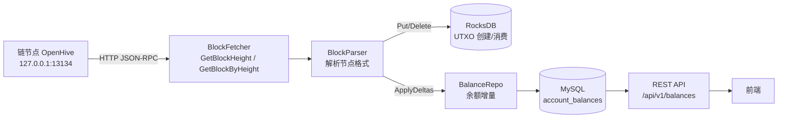

# hubsql 项目总结

> 版本：v2.0（截至 2026-08-24）
> 语言：C++20 ｜ 数据库：MySQL 8.0 ｜ KV：RocksDB ｜ HTTP 服务：crow

---

## 1. 项目概述

从 OpenHive 私有链节点通过 **HTTP JSON-RPC** 拉取数据块，解析区块内交易的 **UTXO**（创建/消费），
用 **RocksDB** 作为 UTXO 的 KV 存储，最终统计出**每个账户的余额**并写入 **MySQL** 的
`account_balances` 表，通过 **REST API** 提供给前端展示。



---

## 2. 链节点接口

节点地址：`http://127.0.0.1:13134`

### 2.1 获取最新高度（GET）

```
GET /GetBlockHeight
```
```json
{"id":"1","jsonrpc":"2.0","result":{"height":"35"},"status":{"code":"0"}}
```

### 2.2 按高度区间拉取区块（POST，JSON-RPC）

```
POST /GetBlockByHeight
Body: {"id":"1","jsonrpc":"2.0","method":"GetBlockByHeight","params":{"begin":0,"end":35}}
```
```json
{"id":"1","jsonrpc":"2.0","result":{"blocks":[...]},...}
```

**支持批量区间拉取**，一个区间返回所有区块（含同高度 DAG 分叉块）。

---

## 3. 区块/交易数据格式（节点返回）

```json
{
  "blocks": {
    "bytes": 25898,
    "hash": "0xef03...",
    "height": 1,
    "merkleRoot": "0x314d...",
    "prevHash": "0xf7c7...",
    "time": 1787275449328256
  },
  "txs": [
    {
      "hash": "0x314d...",
      "identity": "0x755Ccf...",
      "time": 1787275449328256,
      "type": 7,
      "utxos": [
        {
          "owner": ["0x755Ccf..."],
          "vin": { "prevout": { "hash": ["0xae28..."] }, "vinSign": [...] },
          "vout": [ { "addr": "0x...", "value": 100000000000000 } ]
        }
      ]
    }
  ]
}
```

**关键特点**：
- `utxos` 可能是**单个对象**（创世块）或**数组**（普通块），解析时统一为数组
- `vin.prevout` 为 **`[{hash, n}]` 列表**（节点修复后带 `n`），`n` 用于赎回跳过与去重
- `tx.data` 为 JSON 字符串，内含 **txInfo**（`stakeAmount`/`commissionRate`/`stakeType`/`unstakeUtxo` 等）
- `vout.value` 是**数字**，解析时转字符串保持精度
- 交易类型 `type` 为数字：1=奖励、2=质押(STAKE)、3=解质押(UNSTAKE)、4=委托、5=解委托、9=锁仓、10=解锁、99=分红等

---

## 4. UTXO 模型（C++）

`src/model/`：

```cpp
struct Prevout { std::string hash; uint32_t n{0}; };   // 节点 prevout 为 [{hash,n}]
struct Vin     { std::vector<Prevout> prevout; };
struct Vout    { std::string value; std::string addr; };   // value 字符串保精度
struct Utxo    { std::vector<std::string> owner; Vin vin; std::vector<Vout> vout; };
struct Transaction { std::string hash; std::string identity; uint64_t time;
                     uint64_t type; std::vector<Utxo> utxos; std::string data; };
                     // data = 节点 JSON 字符串，内含 txInfo（redeem 哈希等）
struct BlockHeader { uint64_t bytes; std::string hash; uint64_t height;
                     std::string merkleRoot; std::string prevHash; uint64_t time; };
struct Block { BlockHeader blocks; std::vector<Transaction> txs; };
```

> 节点修复后 `prevout` 从"无 n 的 hash 数组"升级为 **`[{hash, n}]` 列表**，交易新增
> **`data`（txInfo）** 字段（含 `stakeAmount` / `unLockUtxo` / `undelegatingUtxo` 等）。

---

## 5. 余额解析规则（核心）

### 5.1 虚拟地址识别

```cpp
// 虚拟/系统地址（不计入真实余额）
IsVirtualAddr = 以 "Virtual" 或 "LockVirtual" 开头
IsSinkAddr    = "VirtualBurnGas" / "VirtualCallFlowOutBurnGas"（纯燃烧，永不消费）
```

数据中的地址分两类：
- **真实账户**（8 个）：`0x755Ccf...`、`0x2E08bA82...` 等
- **虚拟/系统**：`VirtualStake`、`VirtualDelegating`、`LockVirtualStake`、
  `VirtualBurnGas`、`VirtualDeployContractBurnGas`、`VirtualCallContractBurnGas`、
  `VirtualCallFlowOutBurnGas`

### 5.2 解析规则（复刻链 `ca_algorithm::SaveBlock` 余额计数，与节点 `GetBalance` 完全一致）

> 早期"忽略 n + 虚拟优先 + 地址匹配"方案与节点余额**不一致**；节点修复暴露 `n` 与
> `data.txInfo` 后，最终按链源码语义重写，**8/8 账户与节点 `GetBalance` 逐位相等**。

**vout（创建输出 / 加余额）**：
1. 虚拟地址（`Virtual*` / `LockVirtual*`）→ 跳过，不记余额、不写 RocksDB
2. 真实地址 → `RocksDB.Put(...)` 且 `balance[addr] += value`（**所有交易类型都加**，
   含 BONUS/DEPLOY/CALL/FUND）

**vin（消费输入 / 扣余额）**，对每个 `prevout`：
1. 创世引用（全 0）跳过
2. **赎回跳过**：`UNSTAKE/UNDELEGATE/UNLOCK`（type 5/6/10）且
   `prevout.hash == data.txInfo 中 redeem && prevout.n == 1` → 跳过（不扣减）
3. 同 utxo 内 `(hash, n)` 去重
4. 取父交易下 **signer（utxo.owner[0]）的全部未消费输出之和**（等价于链
   `setUtxoValueByUtxoHashes` 对同一 `(hash, addr)` 的**累加**语义，而非覆盖）
   → `balance[signer] -= sum`，并删除这些输出

> 关键：链对同一 `(txhash, addr)` 的多个输出值是**累加**存储的（`_` 连接、读取求和）。
> 例：undelegate `3bc6dbc` 有 2 条 `2E08` 输出（5e13 返还 + 找零）→ 求和扣减；
> unlock `b8ba3af5` 有 2 条 `2E08` 输出（1e10 + 找零）→ 求和扣减。这是余额与节点
> 对齐的决定性细节。

### 5.3 验证结论（0-35 区块，38 块，与节点 `GetBalance` 逐位比对）

| 校验项 | 结果 |
| --- | --- |
| 8 个真实账户余额 vs 节点 `GetBalance` | **8/8 完全一致** |
| RocksDB 未消费输出 | 28 条 |

---

## 6. 存储设计

### 6.1 RocksDB（`src/utxo/utxo_store.*`）

- key   = `txhash:utxo_i:vout_j`
- value = `{"addr": "...", "value": "..."}`
- 创建输出 → `Put`；消费输出 → `Delete`（删除即视为已花费）
- `GetUnspentByTx(hash)` 前缀扫描某交易全部未消费输出

### 6.2 MySQL `account_balances`（`src/storage/balance_repo.*`）

```sql
CREATE TABLE account_balances (
  address    VARCHAR(128) PRIMARY KEY,
  balance    BIGINT NOT NULL DEFAULT 0,
  updated_at TIMESTAMP DEFAULT CURRENT_TIMESTAMP ON UPDATE CURRENT_TIMESTAMP,
  KEY idx_balance (balance)
);
```

- 每区块：`ProcessBlock` 产出各地址余额增量 → 事务批量
  `INSERT ... ON DUPLICATE KEY UPDATE balance = balance + diff`
- 同时维护 `sync_status`（断点续拉）

---

## 7. 采集流水线

```
SyncScheduler (按区间分批)
  → BlockFetcher.GetLatestHeight()          // 最新高度
  → BlockFetcher.FetchBlocks(begin, end)    // 批量拉取（含分叉块）
  → BlockParser.ParseAndStore(block)
      → UtxoProcessor.ProcessBlock          // RocksDB 读写 + 余额增量
      → BalanceRepo.ApplyDeltas             // MySQL 落库
  → SyncRepo.UpdateProgress(latest)         // 更新同步进度
```

- 支持**断点续拉**：重启后从 `sync_status.last_synced_height` 继续
- 支持 **DAG**：`GetBlockByHeight` 按区间返回全部块，含同高度分叉块

---

## 8. REST API

| 方法 | 路径 | 说明 |
| --- | --- | --- |
| GET | `/health` | 健康检查 |
| GET | `/api/v1/balances?page=&size=` | 账户余额列表（按余额降序） |
| GET | `/api/v1/balances/{address}` | 单地址余额 |
| GET | `/api/v1/blocks?...` | 区块列表/详情（旧表） |
| GET | `/api/v1/txs?...` | 交易列表/详情 |
| GET | `/api/v1/staking?address=&is_unstaked=&page=&size=` | 质押记录（含金额/时间/佣金率/类型/解质押标记） |
| GET | `/api/v1/unstaking?address=&page=&size=` | 已解质押视图（`is_unstaked=1`） |
| GET | `/api/v1/investments?address=&is_deinvested=&page=&size=` | 投资记录（金额/时间/bonusAddr/类型/解投资标记） |
| GET | `/api/v1/deinvestments?address=&page=&size=` | 已解投资视图（`is_deinvested=1`） |
| GET | `/api/v1/proposals?address=&is_revoked=&page=&size=` | 提案记录（txInfo/投票数/是否第一笔/撤销标记） |
| GET | `/api/v1/revokedproposals?address=&page=&size=` | 已撤销提案视图（`is_revoked=1`） |
| GET | `/api/v1/votes?address=&proposal_hash=&page=&size=` | 投票记录（被投票提案/类型/投票类型/票数） |
| GET | `/api/v1/stats/overview` | 全局统计 |

统一响应：`{"code":0,"message":"ok","data":{...}}`

---

## 9. 构建与运行

### 9.1 依赖（CMake）

- FetchContent（源码编译）：nlohmann/json、spdlog、crow、**RocksDB(v8.6.7)**、googletest
- 系统包：libcurl、libmysqlcppconn、libasio
- RocksDB 精简编译：`WITH_TESTS/TOOLS/压缩库 OFF`、`PORTABLE=1`（基线便携，避免 `-march=ON`）

```bash
./scripts/setup_build_deps.sh        # 安装系统依赖（sudo）
cmake -S . -B build
cmake --build build -j
```

### 9.2 运行

```bash
./build/src/hubsql config/config.json    # 主程序（采集 + API）
./build/tests/hubsql_tests               # 单元测试
./build/tests/hubsql_verify_balance config/config.json   # 端到端余额验证
```

### 9.3 配置（config.json）

```json
{
  "chain":  { "base_url": "http://127.0.0.1:13134", "batch_size": 50, ... },
  "mysql":  { "host": "127.0.0.1", "port": 3306, "user": "hubsql", ... },
  "api":    { "host": "0.0.0.0", "port": 8080, ... },
  "log":    { "level": "info", "file": "./logs/hubsql.log" },
  "rocksdb":{ "path": "./data/utxo" }
}
```

---

## 10. 端到端验证结果

从真实节点（13134）拉取 0-35 共 **38 个区块**处理，`account_balances` 与节点
`GET /GetBalance`（`{addr, asset_type:"OHI"}`）**逐位一致**：

| 地址 | 余额 | 与节点 |
| --- | --- | --- |
| 0x755Ccf704E17570b64E247f0794314e4C8E542CA | 4,149,999,900,000,000 | ✅ |
| 0x2E08bA82dcF52966dF03Aa0fd830aFAb70d8911d | 139,999,999,814,600 | ✅ |
| 0x03bEE3dB52E736B6422DaC4668CC784d05cb2e63 | 40,065,143,074,938 | ✅ |
| 0x97c0620661F230e5C9CeA46B5492a498cC6cA006 | 39,999,999,938,800 | ✅ |
| 0x8F055beCF0fA0A732344AFC8fB598b9401363724 | 39,999,999,938,800 | ✅ |
| 0x458e53542299BeC018A6118c7544C44d3b8911Df | 39,999,999,938,800 | ✅ |
| 0x26e733E5481c079Abf859DDA613931298C9f0251 | 39,999,999,938,800 | ✅ |
| 0x072DB292dC387760aF7c83A7c2d88CAC0846feE7 | 39,999,999,938,800 | ✅ |

- RocksDB 未消费输出：**28 条**
- `sync_status` 进度正确持久化（断点续拉可用）
- API `/api/v1/balances` 返回与数据库一致

---

## 11. 关键技术决策与踩坑记录

| 问题 | 结论/解决 |
| --- | --- |
| 早期余额与节点不一致 | 曾用"忽略 n + 虚拟优先 + 地址匹配"；节点修复暴露 `n`+`txInfo` 后，按链 `SaveBlock` 语义重写（vout 全部加 + 同 `(hash,addr)` 值累加 + redeem@n==1 跳过），8/8 对齐 |
| 节点 `prevout` 无 `n` 怎么办 | 节点已修复为 `[{hash,n}]`；`n` 仅用于赎回跳过（`redeem@n==1`）与同 utxo 去重，**不用 n 定位输出** |
| 同一交易多条同地址输出 | 链 `setUtxoValueByUtxoHashes` 是**累加**（`_` 连接、读取求和）；扣减时须按 `(hash, addr)` **求和**而非覆盖（undelegate/unlock 多输出场景） |
| 赎回交易（UNSTAKE/UNDELEGATE/UNLOCK） | `data.txInfo` 的 `unstakeUtxo/unLockUtxo/undelegatingUtxo` 定位赎回目标；`prevout.hash==redeem && n==1` 跳过扣减（返还 utxo 不计余额） |
| `utxo.gas` 含义 | 1=支付 gas（找零 utxo），0=非 gas（赎回/返还 utxo） |
| BONUS/DEPLOY/CALL/FUND 的 vout | **仍计入余额**（链的 `balance += value` 在 txType 分支之外），仅虚拟燃烧地址除外 |
| RocksDB 编译报错 `-march=ON` | 其 `PORTABLE` 是 STRING 变量：0=本机、1=基线、其他=当架构名 → 设 `PORTABLE=1` |
| `sync_status` 进度不持久化 | 连接池 `setAutoCommit(false)` 未复位导致写入未提交 → 归还连接时 `rollback + setAutoCommit(true)` |
| 主程序 `std::signal` 失效 | 多线程下改用 **sigwait 专用信号线程**，SIGTERM 才能优雅退出 |
| 模型与节点格式不一致 | 节点 utxos 对象/数组、value 数字 → `Block::FromJson` 手动规范化 |

---

## 12. 目录结构

```
hubsql/
├── CMakeLists.txt
├── config/config.json
├── docs/
│   ├── 架构设计方案.md
│   ├── MySQL部署文档.md
│   └── 项目总结.md            # 本文档
├── sql/schema.sql + migration/
├── deploy/mysql-portable/     # 便携式 MySQL（脚本部署）
├── src/
│   ├── main.cpp
│   ├── common/                # 配置/日志/线程池
│   ├── model/
│   │   ├── block.h / transaction.h   # 区块/交易模型（节点格式）
│   │   └── business/                 # 业务记录结构（按业务拆分）
│   │       ├── stake_record.*        # 质押记录
│   │       ├── unstake_record.*      # 解质押记录
│   │       ├── investment_record.*   # 投资记录（DELEGATE=4）
│   │       ├── deinvest_record.*     # 解投资记录（UNDELEGATE=5）
│   │       ├── proposal_record.*     # 提案记录（PROPOSAL=11）
│   │       ├── revoke_record.*       # 撤销提案记录（REVOKEPROPOSAL=12）
│   │       └── vote_record.*         # 投票记录（VOTE=13）
│   ├── fetcher/               # HttpClient/BlockFetcher/SyncScheduler
│   ├── utxo/                  # UtxoStore(RocksDB)/UtxoProcessor(规则)
│   ├── parser/
│   │   ├── block_parser.*        # 组装：UTXO+余额+注册表分发业务
│   │   ├── ibusiness_module.h    # 业务模块接口（解析+存储一体，注册制）
│   │   ├── business_registry.*   # 业务注册表（按注册模块统一调度）
│   │   └── parsers/              # 各业务解析器 + 业务模块（可插拔）
│   ├── storage/                 # DbPool/BalanceRepo/SyncRepo + 每业务一仓库
│   │   ├── staking_repo.*       # 质押存储（插入+解质押标记+查询）
│   │   ├── investment_repo.*    # 投资存储（插入+解投资标记+查询）
│   │   ├── proposal_repo.*      # 提案存储（插入+撤销标记+投票计数+查询）
│   │   └── vote_repo.*          # 投票存储（插入+查询）
│   └── api/                     # ApiServer + 控制器（业务按注册表通用分发）
├── tests/
│   ├── test_config.cpp / test_parser.cpp
│   └── verify_balance.cpp     # 端到端余额验证工具
└── scripts/setup_build_deps.sh
```

---

## 13. 待办/可扩展方向

- [ ] 余额**变更历史**表（记录每次余额变动，便于审计/前端走势图）
- [ ] `sync_status` 支持按区块 hash 精确断点（DAG 下更严谨）
- [ ] 前端接入 `GET /api/v1/balances`
- [x] 交易类型业务解析：**质押/解质押**已落到 `staking_records` 表（解质押仅标记 `is_unstaked`，不删除记录），并接入 REST API
- [ ] 委托/锁仓等其余业务解析（沿用注册表扩展点）
- [ ] 多节点高可用、写入性能优化（批量提交）
